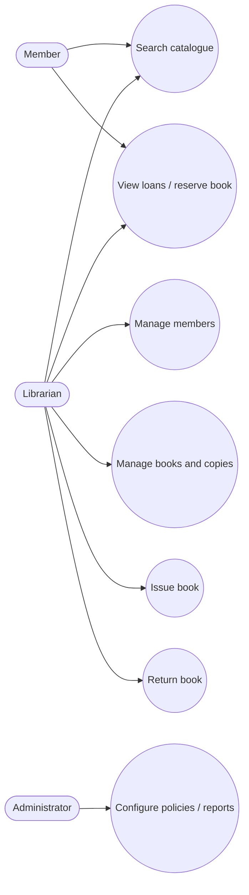
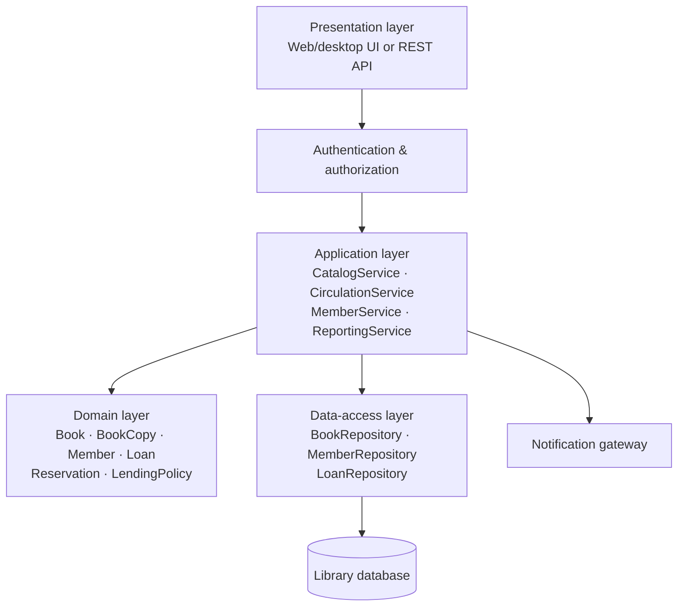
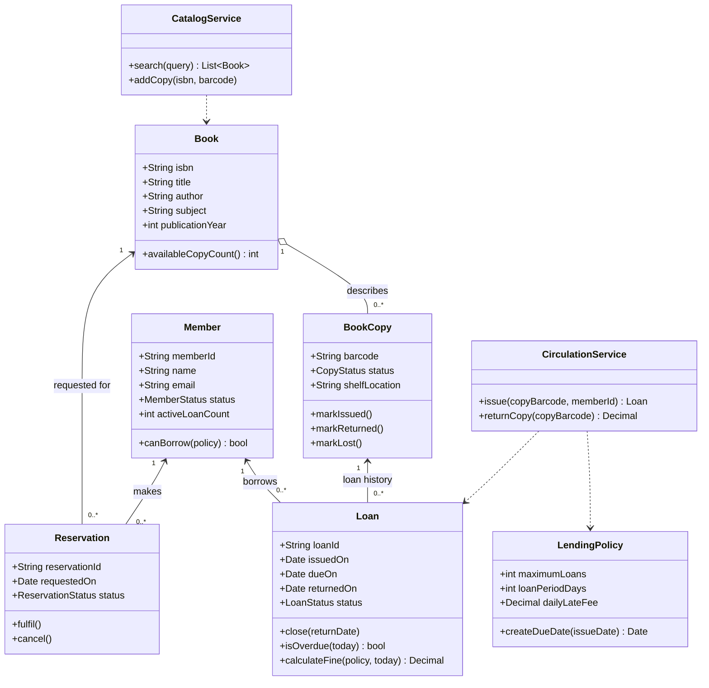
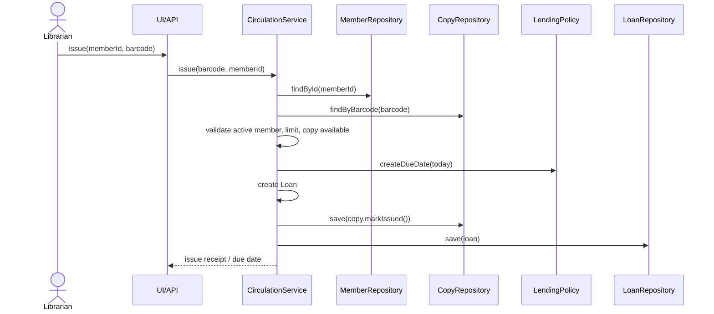
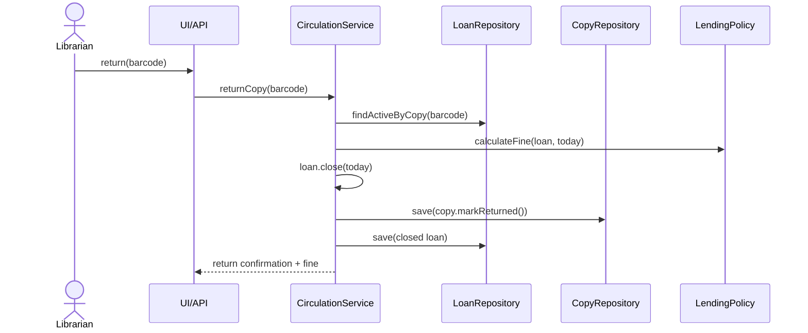
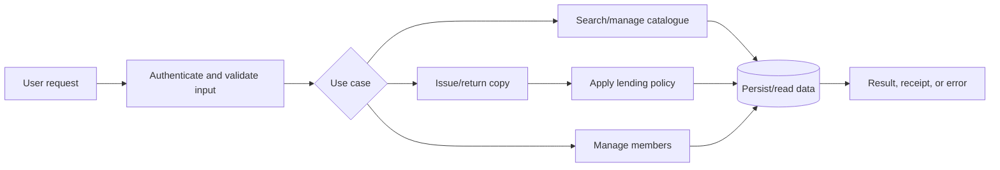
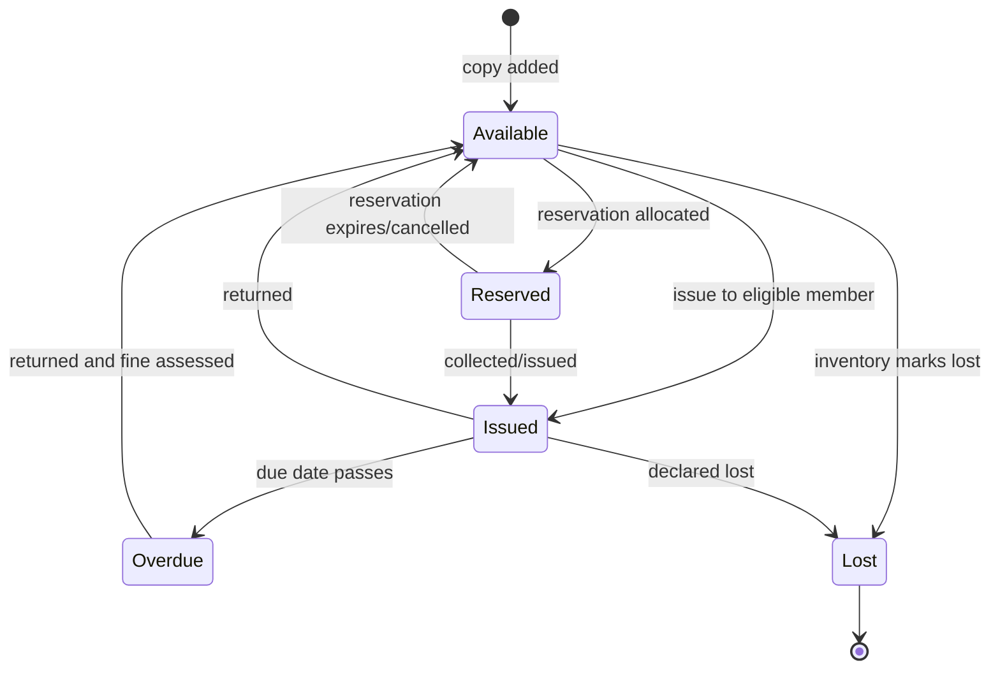

# Library Management System — Object-Oriented Analysis & Design

## 1. Scope and assumptions

This simplified system manages the library catalogue, member accounts, and the lending lifecycle of individual book copies. A librarian administers books, copies, members, and loans. Members browse/search the catalogue and view their own loans.

Business rules:

- A `Book` describes a title; a `BookCopy` is a physical lendable item.
- A copy may have one active loan at a time.
- Only active members may borrow books.
- A loan has a due date; returning it makes the copy available again.
- The default maximum active-loan limit is five per member (configurable).

## 2. Requirement analysis

### Actors

| Actor | Responsibilities |
|---|---|
| Member | Search the catalogue; view availability and personal loans. |
| Librarian | Manage catalogue and members; issue and return copies; manage reservations. |
| Administrator | Configure lending rules; manage librarian accounts; run reports. |

### Key use cases

| Use case | Primary actor | Outcome |
|---|---|---|
| Search catalogue | Member, Librarian | Matching books and available-copy counts are displayed. |
| Register/update member | Librarian | A valid member profile is created or amended. |
| Add book/copy | Librarian | A bibliographic record and/or physical copy is added. |
| Issue book | Librarian | An available copy is assigned to an eligible member with a due date. |
| Return book | Librarian | An active loan is closed; late fee is recorded if applicable. |
| Reserve book | Member, Librarian | A request is queued when no copy is available. |
| Configure policies/report | Administrator | Rules or operational information are maintained/generated. |

### Use-case diagram



## 3. Architecture design

The system uses a layered architecture. The presentation layer has no direct database access; the application layer coordinates use cases; the domain layer owns business rules; repositories hide persistence technology.



Component responsibilities:

- **Presentation:** validates basic input, presents results, and enforces role-aware navigation.
- **Application services:** start transactions, load aggregates, apply a use case, and persist changes.
- **Domain:** models state and invariants such as borrow eligibility and copy availability.
- **Data access:** maps domain objects to durable storage.
- **Infrastructure:** supplies notifications, authentication, and database integration.

## 4. Object-oriented analysis



`Book` and `BookCopy` are deliberately separate: changing the availability of one physical copy must not change the title-level information. Services orchestrate work; entities protect their own valid state transitions.

## 5. Interaction diagrams

### Issue book



### Return book



## 6. Data, functional, and behavioral models

### Data model

| Entity | Key data | Relationships |
|---|---|---|
| Book | ISBN, title, author, subject, publication year | One book has zero or more copies. |
| BookCopy | barcode, ISBN, status, shelf location | Belongs to one book; has loan history. |
| Member | member ID, name, email, status | Has loans and reservations. |
| Loan | loan ID, barcode, member ID, issue/due/return dates, status | Links one member and one copy. |
| Reservation | reservation ID, ISBN, member ID, requested date, status | Links a member to a book title. |

Suggested integrity constraints: unique ISBN, barcode, member ID, and loan ID; one active loan per `BookCopy`; `returnedOn` required only for closed loans.

### Functional model



### Book-copy state diagram



## 7. Abstraction to implementation

The following pseudocode keeps domain rules inside the relevant objects and leaves persistence to repositories.

```text
class BookCopy:
    barcode
    status = AVAILABLE

    method issue():
        if status != AVAILABLE:
            raise CopyNotAvailable
        status = ISSUED

    method returnToLibrary():
        if status not in [ISSUED, OVERDUE]:
            raise InvalidReturn
        status = AVAILABLE

class Member:
    method canBorrow(policy):
        return status == ACTIVE and activeLoanCount < policy.maximumLoans

class CirculationService:
    method issue(barcode, memberId):
        member = memberRepository.get(memberId)
        copy = copyRepository.get(barcode)
        if not member.canBorrow(policy):
            raise BorrowingNotAllowed
        copy.issue()
        loan = Loan.new(member, copy, today, policy.createDueDate(today))
        transaction.save(copy, loan)
        return loan

    method returnCopy(barcode):
        loan = loanRepository.getActiveForCopy(barcode)
        fine = loan.calculateFine(policy, today)
        loan.close(today)
        loan.copy.returnToLibrary()
        transaction.save(loan.copy, loan)
        return fine
```

## 8. Implementation boundary and next steps

This design intentionally stops before a full build. The next implementation increment should establish the domain classes and repository interfaces, then implement `search`, `issue`, and `return` with automated tests for availability, loan limits, and overdue handling.
